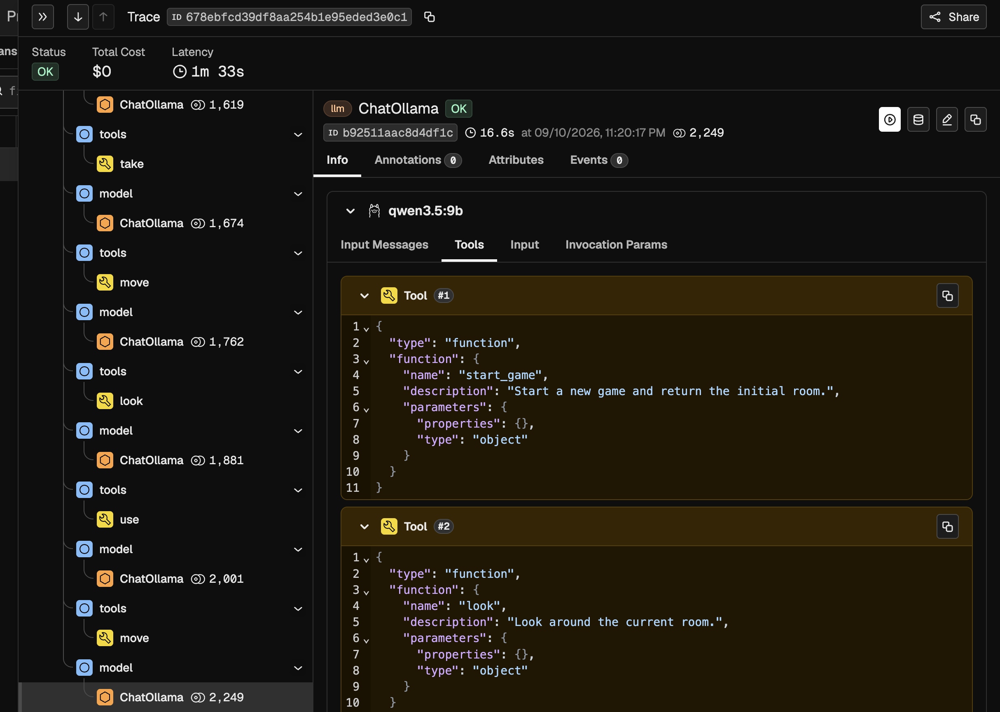
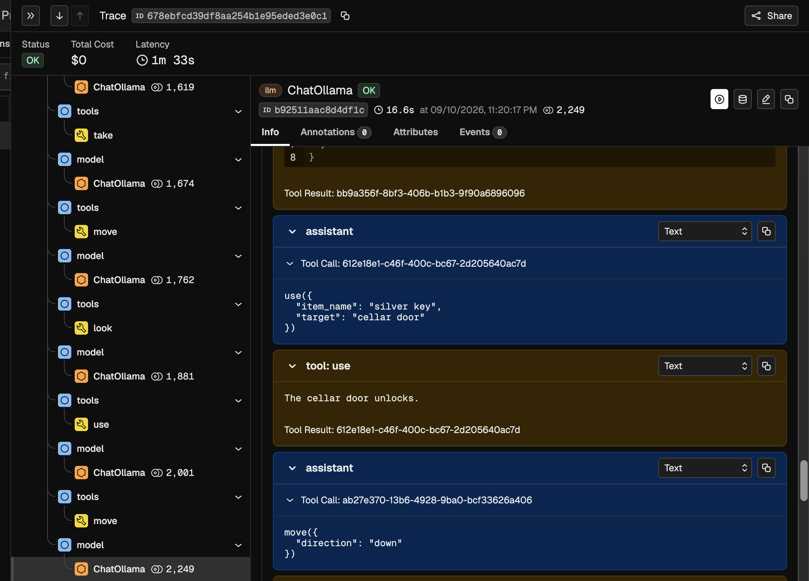

# Setup a MCP Server and let an Agent interact with it
## Start Phoenix Server
`phoenix serve` should start a server on `http://localhost:6006`

## Start the MCP Server: Not needed
Since we are using stdio, we dont need to start the server manually. Langchain can handle that.

Suppose we had an `http` server. In that case, we would use the server URL and pass it to Langchain MCP Client.

Manually start the server usin
```python
mcp.run(transport="streamable-http")
```

and then connect via

```python
client = MultiServerMCPClient(
    {
        "game": {
            "transport": "streamable_http",
            "url": "http://127.0.0.1:8000/mcp",
        }
    }
)
```

## Run the game
`python agent.py`

## Check the trace
Tool Definitions


Example of Tool Call

